# Nas.Net - Your Lightweight Private Cloud Storage Solution

## Project Introduction
In the era of interconnected devices, are you facing the following challenges?

*   **Device Proliferation**: With increasing numbers of smartphones, tablets, laptops, desktops, and HarmonyOS devices, is file transfer between multiple devices cumbersome and version control chaotic?
*   **Data Anxiety**: Phone photo albums containing tens of thousands of images consuming massive storage space, with worries about data loss but no secure backup solution?
*   **Privacy Concerns**: Public cloud drives with speed limits, excessive ads, and reluctance to upload enterprise data or personal privacy files?
*   **Idle Hardware**: Old computers and idle machines at home with过剩 performance having no use except gathering dust, while purchasing professional NAS hardware is too costly?

## Solution
**Nas.Net** is a cross-platform private cloud storage software dedicated to providing simple, convenient, and secure **private cloud storage services** for individuals, families, and small teams. It can run directly on various existing devices, breathing new life into your older equipment and helping you solve data synchronization and secure backup challenges in the multi-terminal era!

Its core mission is: **Utilize idle equipment to build your own private cloud center.**

Without the need to purchase expensive hardware NAS, simply deploy Nas.Net on your existing Windows or Linux computer, and instantly transform it into a fully functional private cloud server.

## Core Features
1. **📱 Cross-Platform File Synchronization**: Supports Android, HarmonyOS, Windows, Linux, and multiple other platforms. Photos, documents, and videos sync automatically, accessible anytime, anywhere.
2. **🔒 Private Deployment, Data Security**: All files are stored on your own devices, away from public cloud leakage risks. Enterprise-level data security is under your control.
3. **💻 Revitalize Idle Hardware**: Let old desktops and laptops continue to serve, building a personal storage center at zero cost.
4. **⚡ Lightweight and Efficient, Based on .NET**: Leveraging .NET cross-platform technology with excellent performance, low resource consumption, and stable, reliable operation.

## Software Screenshots
#### Web Interface:  
  - User Login
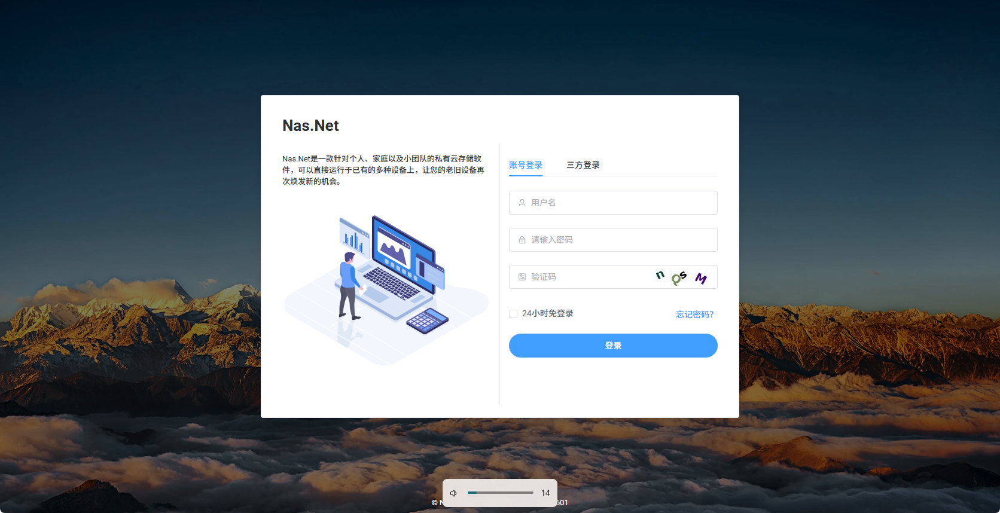
  - User Homepage

  - File Management
  
  - Notepad
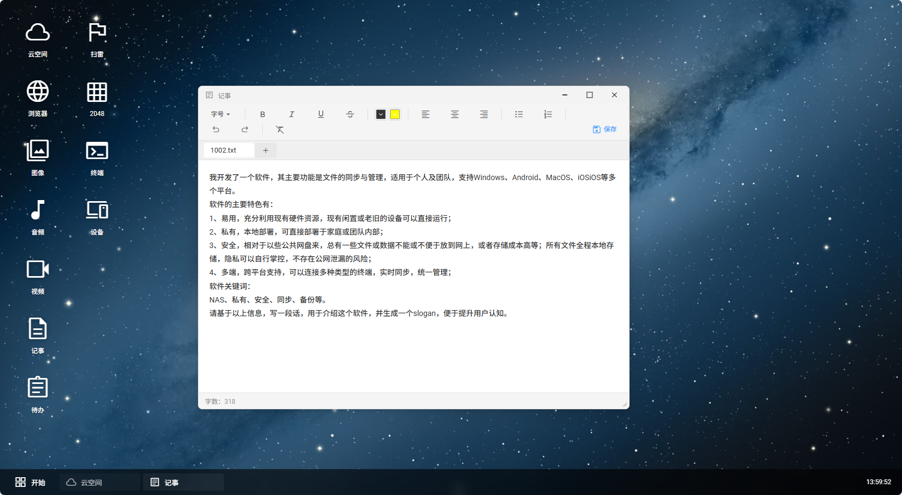  
  - Images
  
  - Audio
  
  - Tasks
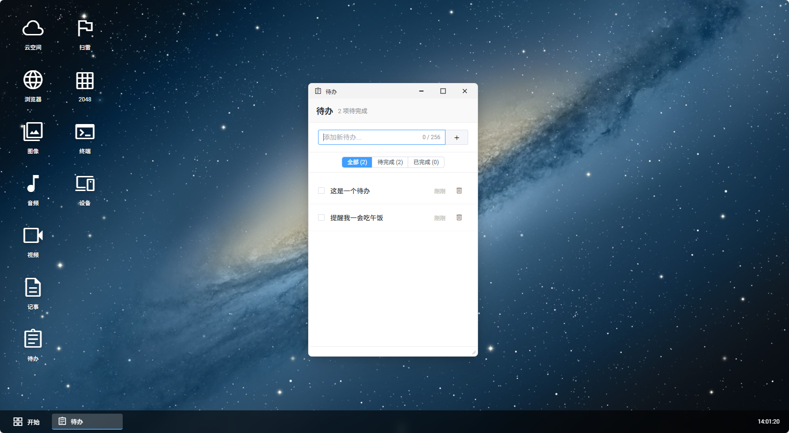  
  - Terminal Management
  

#### Desktop Client:  
  - Device Binding
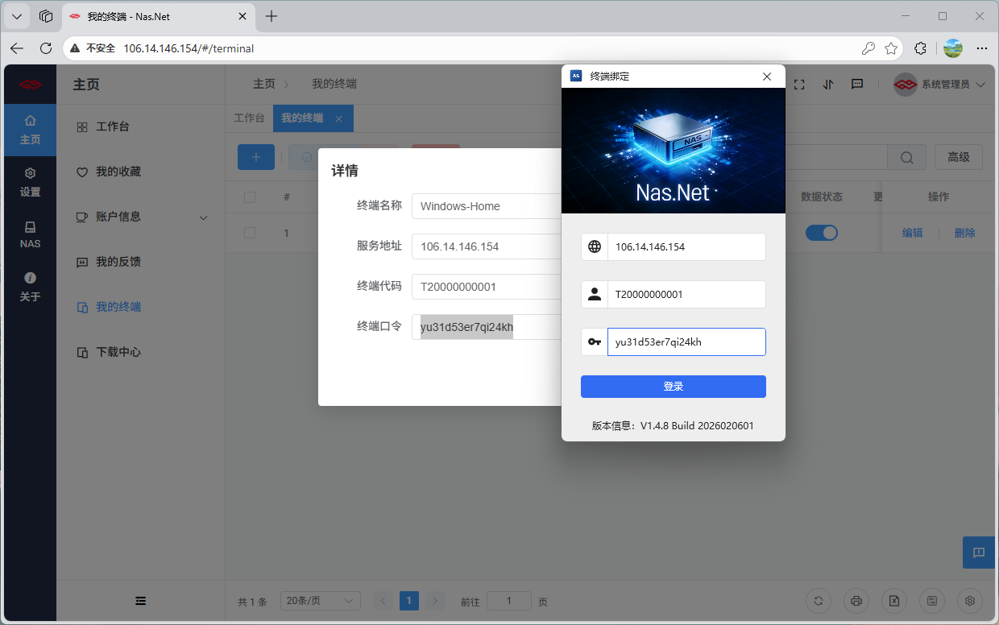  
  - Sync Directories
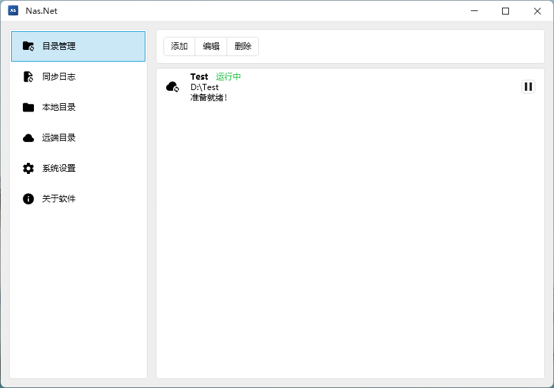  
  - Sync Logs
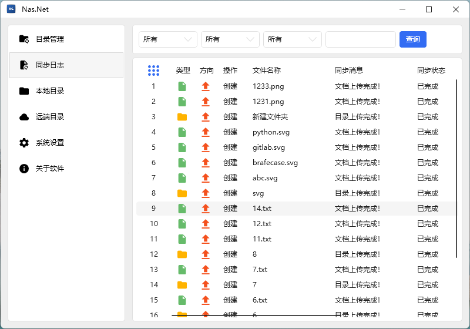    
  - Local Files
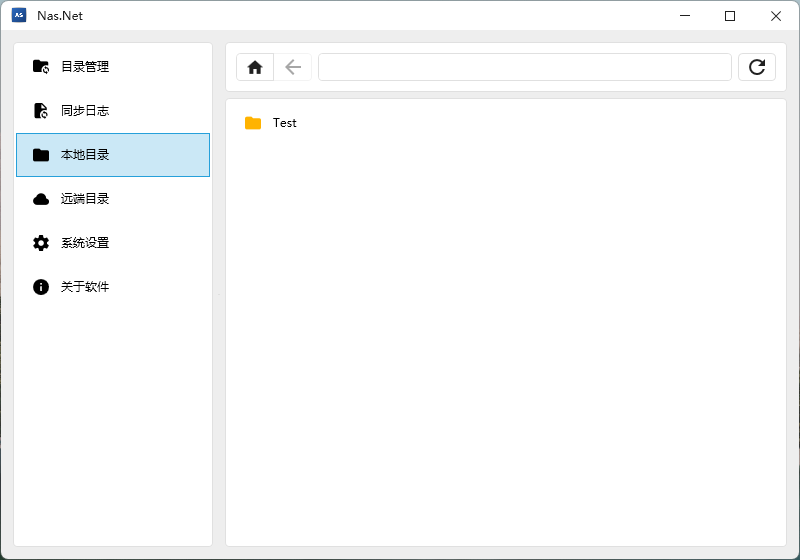    
  - Remote Files
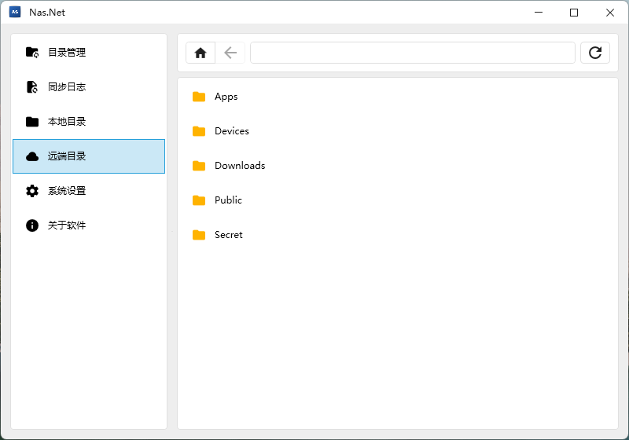    
  - About Software
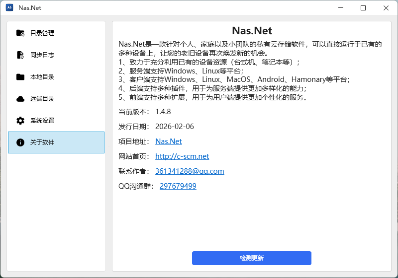  
 
#### Mobile Client:  
  - Device Binding
  
  - Sync Directories
  
  - Sync Logs
    
  - About Software
  
 
#### Environment Configuration: 
  - Local Directories
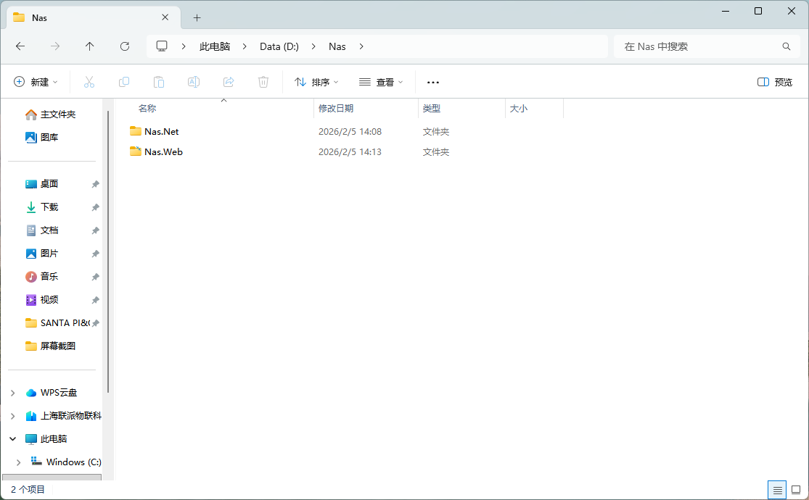  
  - Web Main Program
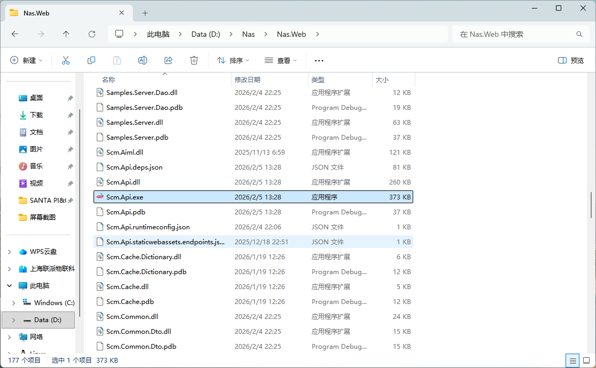  
  - Web Startup Success
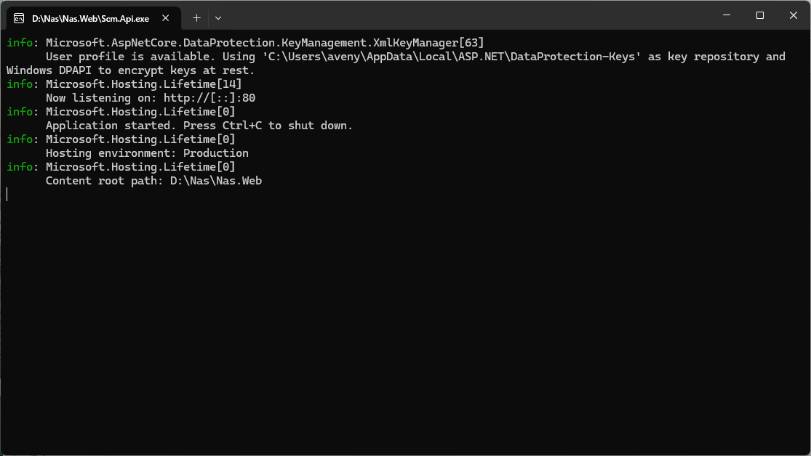  
  - Desktop Main Program
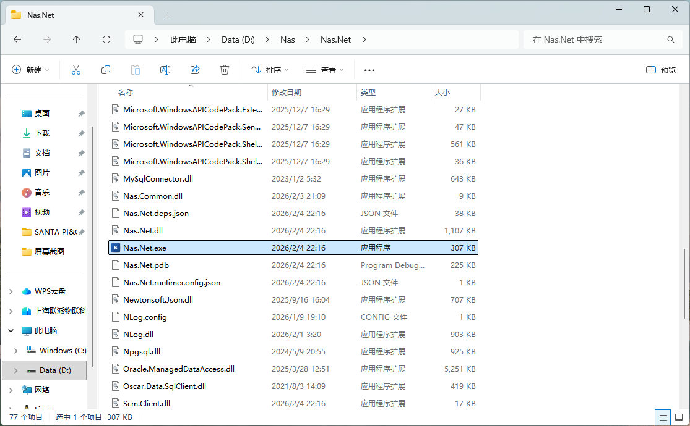  
  
## Detailed Feature Description
1. **Intelligent File Synchronization**
   - Real-time Bidirectional Sync: Local and cloud files automatically stay consistent
   - Incremental Sync: Only transfers changed portions, saving bandwidth and time
   - Resume from Breakpoint: Automatically resumes after network interruption, ensuring reliability for large file transfers
   - Selective Sync: Choose sync directories as needed, flexibly controlling storage space

2. **Security & Privacy**
   - Data Encryption: Transmission uses HTTPS encryption to protect data security
   - Permission Management: Fine-grained user permission control ensuring secure data access
   - Local Storage: All data stored on your own devices, complete control over data sovereignty
   - Access Control: Supports IP whitelist, login verification, and multiple security mechanisms

3. **Convenient Management**
   - Web Management: Manage files and users anytime, anywhere through a browser
   - Terminal Management: Unified management of all sync devices, monitoring sync status
   - Logging: Detailed operation logs for troubleshooting and auditing
   - Multi-User Support: Supports multi-user registration and usage, suitable for families and small teams

4. **Extension & Integration**
   - Custom Storage Paths: Files can be stored on any disk partition or external storage
   - Flexible Database Configuration: Defaults to SQLite, can be switched to other databases as needed
   - Cross-Platform Support: Server supports Windows, Linux, MacOS; clients cover mainstream operating systems

## About the Project
Nas.Net is deeply developed based on the **[Scm.Net](https://gitee.com/openscm/scm.net)** project, aiming to provide users with a **simple, stable, secure, and user-friendly** private cloud storage solution.

🚀 **The software is currently in a phase of rapid iteration and improvement**, and we greatly look forward to your feedback. If you have good suggestions or opinions, please feel free to contact us anytime to build a better Nas.Net together!

## Environment Dependencies
### Server
- Operating System: No dependencies, can be used directly on Windows, Linux, MacOS, etc.;
- Runtime Environment: Depends on [Asp.Net Core Runtime] 10.0, [Download Link](https://dotnet.microsoft.com/zh-cn/download/dotnet/10.0);
- Database: No dependencies, defaults to [SQLite], can be adjusted as needed;

### Client
- Windows Client: Depends on [.NET Desktop Runtime] 10.0, [Download Link](https://dotnet.microsoft.com/zh-cn/download/dotnet/10.0);
- Android Client: No dependencies, install directly;

## System Installation
### Server (Windows)
- Install Runtime: Directly download [ASP.NET Core Runtime], default installation is sufficient;
- Extract Files: Extract the [Nas.Web.zip] file to a specified directory (e.g., D:\Nas);
- Run Server: Open command line, navigate to [D:\Nas\Nas.Web] directory, directly run [.\Scm.Api.exe], or double-click the [Scm.Api.exe] file;
- Access Server: Open browser, visit [http://localhost:9999] to access the backend.

### Server (MacOS)
- Install Runtime: Directly download [ASP.NET Core Runtime], default installation is sufficient;
- Extract Files: Extract the [Nas.Web.zip] file to a specified directory (e.g., ~/Nas);
- Run Server: Open command line, navigate to [~/Nas/Nas.Web] directory, directly run [dotnet ./Scm.Net.dll];
- Access Server: Open browser, visit [http://localhost:9999] to access the backend.

### Server (Linux, Ubuntu as example)
- Install Runtime: Directly execute the following command:
``sudo apt-get update && sudo apt-get install -y aspnetcore-runtime-10.0``
- Extract Files: Extract the [Nas.Web.zip] file to a specified directory (e.g., ~/Nas);
- Run Server: Open command line, navigate to [~/Nas/Nas.Web] directory, directly run [dotnet ./Scm.Net.dll];
- Access Server: Open browser, visit [http://localhost:9999] to access the backend.

### Client (Windows)
- Install Runtime: Directly download [.NET Desktop Runtime], default installation is sufficient;
- Extract Files: Extract the [Nas.Wpf.zip] file to a specified directory (e.g., D:\Nas\Nas.Wpf);
- Run Client: Directly run the [Nas.Wpf.exe] file, and the system will open the client.

### Notes
- Server and client directories should not be too deep; limited by the operating system, file path length cannot exceed 256 characters;
- Currently only supports file synchronization for files no larger than 5MB; support for super large files needs improvement.
- Default access address: http://localhost:9999, default login user: admin, default login password: 123456, you can modify it yourself after logging in:

## Demo Address
- **Login Address**: [Click to Login](http://www.c-scm.net)
- **Admin Account**:
  - Username: admin@demo
  - Password: 123456
- **Regular Account**:
  - Username: user@demo
  - Password: 123456

## Download Links
[Server Download](http://www.c-scm.net/download/nas.web.zip)  
[Desktop Download](http://www.c-scm.net/download/nas.net.zip)  
 
## QQ Communication Group
  
Join the communication group: 423358584